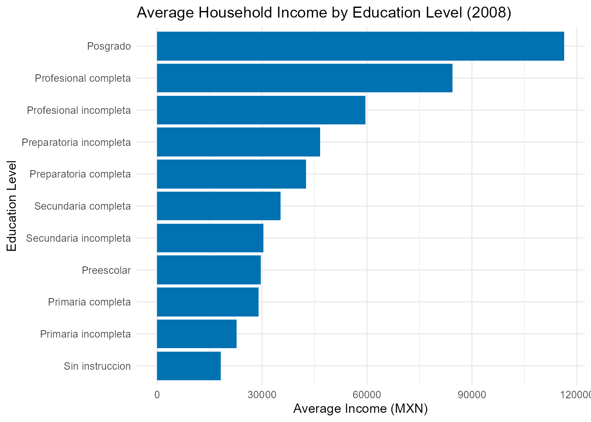

# MexicoDataAPI: Access Mexican Data via APIs and Curated Datasets

``` r

library(MexicoDataAPI)
library(ggplot2)
library(dplyr)
#> 
#> Attaching package: 'dplyr'
#> The following objects are masked from 'package:stats':
#> 
#>     filter, lag
#> The following objects are masked from 'package:base':
#> 
#>     intersect, setdiff, setequal, union
```

## Introduction

The `MexicoDataAPI` package provides a unified interface to access open
data from the **World Bank API** and **Nager.Date API**, with a focus on
Mexico. It allows users to retrieve up-to-date information on topics
such as economic indicators, population figures, literacy rates,
unemployment levels, and official public holidays.

In addition to API-access functions, the package includes a set of
curated datasets related to **Mexico**. These cover areas such as air
quality monitoring, state-level income surveys, postal abbreviations,
election results, and regional forest classification.

`MexicoDataAPI` is intended to support users working with data related
to Mexico by integrating international API sources with selected
datasets from national and academic origins, in a single R package.

### Functions for MexicoDataAPI

The `MexicoDataAPI` package provides several core functions to access
real-time and structured information about Mexico from public APIs such
as the [World Bank
API](https://datahelpdesk.worldbank.org/knowledgebase/articles/889392)
and [Nager.Date API](https://date.nager.at/Api).

Below is a list of the main functions included in the package:

- [`get_mexico_cpi()`](https://lightbluetitan.github.io/mexicodataapi/reference/get_mexico_cpi.md):
  Get Mexico’s Consumer Price Index (2010 = 100) from World Bank

- [`get_mexico_gdp()`](https://lightbluetitan.github.io/mexicodataapi/reference/get_mexico_gdp.md):
  Get Mexico’s GDP (Current US\$) from World Bank

- [`get_mexico_holidays()`](https://lightbluetitan.github.io/mexicodataapi/reference/get_mexico_holidays.md):
  Get official public holidays in Mexico for a given year, e.g.,
  `get_mexico_holidays(2025)`.

- [`get_mexico_life_expectancy()`](https://lightbluetitan.github.io/mexicodataapi/reference/get_mexico_life_expectancy.md):
  Get Mexico’s Life Expectancy from World Bank

- [`get_mexico_literacy_rate()`](https://lightbluetitan.github.io/mexicodataapi/reference/get_mexico_literacy_rate.md):
  Get Mexico’s Literacy Rate (Age 15+) from World Bank

- [`get_mexico_population()`](https://lightbluetitan.github.io/mexicodataapi/reference/get_mexico_population.md):
  Get Mexico’s Population (Total) from World Bank

- [`get_mexico_unemployment()`](https://lightbluetitan.github.io/mexicodataapi/reference/get_mexico_unemployment.md):
  Get Mexico’s Unemployment Rate (%) from World Bank

- [`view_datasets_MexicoDataAPI()`](https://lightbluetitan.github.io/mexicodataapi/reference/view_datasets_MexicoDataAPI.md):
  Lists all curated datasets included in the `MexicoDataAPI` package

These functions allow users to access high-quality and structured
information on `Mexico`, which can be combined with tools like `dplyr`,
`tidyr`, and `ggplot2` to support a wide range of data analysis and
visualization tasks. In the following sections, you’ll find examples on
how to work with `MexicoDataAPI` in practical scenarios.

#### Mexico’s GDP (Current US\$) from World Bank 2022 - 2017

``` r


mexico_gdp <- head(get_mexico_gdp())

print(mexico_gdp)
#> # A tibble: 6 × 5
#>   indicator         country  year   value value_label      
#>   <chr>             <chr>   <int>   <dbl> <chr>            
#> 1 GDP (current US$) Mexico   2022 1.47e12 1,466,934,724,243
#> 2 GDP (current US$) Mexico   2021 1.32e12 1,316,569,466,834
#> 3 GDP (current US$) Mexico   2020 1.12e12 1,121,064,767,169
#> 4 GDP (current US$) Mexico   2019 1.30e12 1,304,106,204,006
#> 5 GDP (current US$) Mexico   2018 1.26e12 1,256,300,182,984
#> 6 GDP (current US$) Mexico   2017 1.19e12 1,190,721,475,853
```

#### Mexico’s Life Expectancy from World Bank 2022 - 2017

``` r


life_expectancy <- head(get_mexico_life_expectancy())

print(life_expectancy)
#> # A tibble: 6 × 4
#>   indicator                               country  year value
#>   <chr>                                   <chr>   <int> <dbl>
#> 1 Life expectancy at birth, total (years) Mexico   2022  74.0
#> 2 Life expectancy at birth, total (years) Mexico   2021  69.8
#> 3 Life expectancy at birth, total (years) Mexico   2020  70.4
#> 4 Life expectancy at birth, total (years) Mexico   2019  74.5
#> 5 Life expectancy at birth, total (years) Mexico   2018  74.3
#> 6 Life expectancy at birth, total (years) Mexico   2017  74.3
```

#### Mexico’s Population (Total) from World Bank 2022 - 2017

``` r


mexico_population <- head(get_mexico_population())

print(mexico_population)
#> # A tibble: 6 × 5
#>   indicator         country  year     value value_label
#>   <chr>             <chr>   <int>     <int> <chr>      
#> 1 Population, total Mexico   2022 128613117 128,613,117
#> 2 Population, total Mexico   2021 127648148 127,648,148
#> 3 Population, total Mexico   2020 126799054 126,799,054
#> 4 Population, total Mexico   2019 125762982 125,762,982
#> 5 Population, total Mexico   2018 124573711 124,573,711
#> 6 Population, total Mexico   2017 123400057 123,400,057
```

#### Average Household Income by Education Level (2008)

``` r


# Summary of average income by education level
avg_income_by_education <- mex_income_2008_tbl_df %>%
  group_by(education) %>%
  summarise(avg_income = mean(income, na.rm = TRUE)) %>%
  arrange(desc(avg_income))

# Plot
ggplot(avg_income_by_education, aes(x = reorder(education, avg_income), y = avg_income)) +
  geom_col(fill = "#0072B2") +
  coord_flip() +
  labs(
    title = "Average Household Income by Education Level (2008)",
    x = "Education Level",
    y = "Average Income (MXN)"
  ) +
  theme_minimal()
```



### Dataset Suffixes

Each dataset in `MexicoDataAPI` is labeled with a *suffix* to indicate
its structure and type:

- `_df`: A standard data frame.

- `_tbl_df`: A tibble data frame object.

- `_chr`: A character object.

### Datasets Included in MexicoDataAPI

In addition to API access functions, `MexicoDataAPI` provides several
preloaded datasets related to Mexico’s environment, demographics, and
public data. Here are some featured examples:

- `mexico_elections_df`: Data frame containing a subset of the 2012
  Mexico Elections Panel Study.

- `mex_income_2016_tbl_df`: Tibble containing household-level income
  data and associated demographic characteristics from the 2016 ENIGH
  (Household Income and Expenditure Survey).

- `mexico_abb_chr`: Character vector containing the official two- or
  three-letter postal abbreviations for the 32 federal entities of
  Mexico.

### Conclusion

The `MexicoDataAPI` package provides a comprehensive interface to access
open data about **Mexico** through RESTful APIs and curated datasets. It
includes functions to retrieve real-time information from the **World
Bank API** and **Nager.Date API**, covering topics such as population,
GDP, CPI, life expectancy, literacy, unemployment, and official public
holidays. In addition, the package offers curated datasets related to
air quality monitoring stations, pollution zones, state-level income
surveys for 2008 and 2016, postal abbreviations, election studies, and
ecological data from the Chiapas dry forests. Together, these resources
support research, teaching, and analysis focused on Mexico’s economic,
environmental, and sociopolitical landscape.
