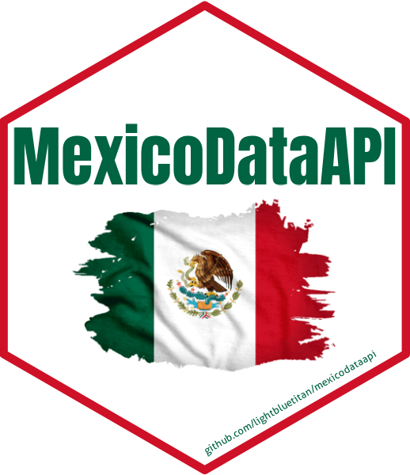

# MexicoDataAPI: Access Mexican Data via APIs and Curated Datasets

This package provides functions to access data from the 'World Bank
API','REST Countries API' and 'Nager.Date API', covering Mexico's
economic indicators, population statistics, literacy rates,
international geopolitical information and official public holidays. The
package also includes curated datasets related to Mexico such as air
quality monitoring stations, pollution zones, income surveys, postal
abbreviations, election studies and more.

## Details

MexicoDataAPI: Access Mexican Data via APIs and Curated Datasets

Access Mexican Data via APIs and Curated Datasets.

## See also

Useful links:

- <https://github.com/lightbluetitan/mexicodataapi>

## Author

**Maintainer**: Renzo Caceres Rossi <arenzocaceresrossi@gmail.com>
